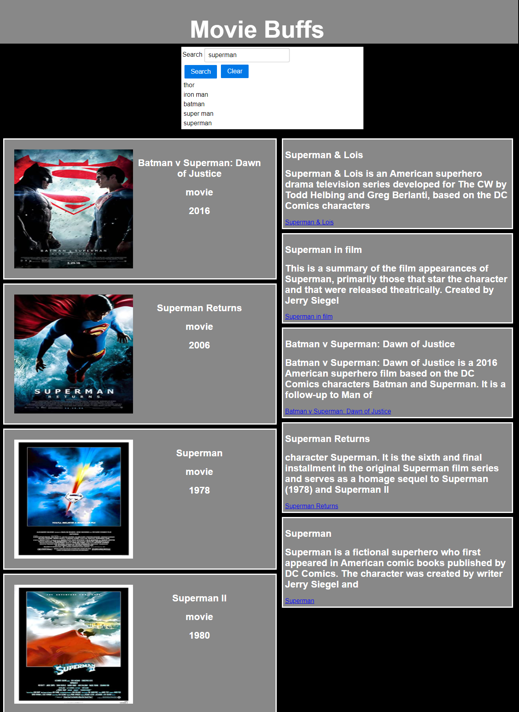

# Movie-Buffs-Group-Project 

##Github repository and github pages link

[Github Link](https://github.com/JG-77/Movie-Buffs-Group-Project.git)

[Published Webpage](https://jg-77.github.io/Movie-Buffs-Group-Project/)

Requirements:

* Use a CSS framework other than Bootstrap.
* Be deployed to GitHub Pages.
* Be interactive (i.e., accept and respond to user input).
* Use at least two server-side APIs.
* Does not use alerts, confirms, or prompts (use modals).
* Use client-side storage to store persistent data.
* Be responsive.
* Have a polished UI.
* Have a clean repository that meets quality coding standards (file structure, naming conventions, follows best practices for class/id naming conventions, indentation, quality comments, etc.).
* Have a quality README (with unique name, description, technologies used, screenshot, and link to deployed application).

HTML 

* Added SweetAlerts2 and Pure CSS extensions
* Search form elements and buttons
* Sections for displaying content
* Script tags for SweetAlerts2 and AJAX/JQuery

CSS 

* Media Query styling
* CSS styling
* Pure CSS styling for form and buttons

Javascript

* Added search button event
* API variables and Ajax API call functions
* For loops for creating search history items and section cards
* Function for displaying search history from local storage on page refresh 
* Function and event for clearing history

